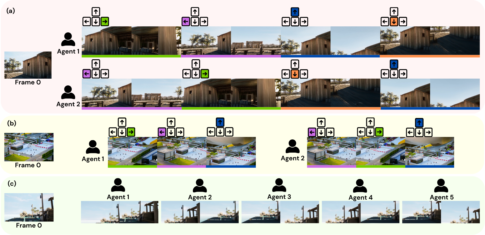

# ConsistWorld

ConsistWorld is a multi-agent autoregressive video world model built on
[lingbot-world-v2-14b-causal-fast](https://huggingface.co/robbyant/lingbot-world-v2-14b-causal-fast). It combines Pose Conditioned Memory Retrieval for recalling relevant historical evidence across agents with Visibility-Gated Peer Sharing for coordinating concurrent views.

<h3 align="center">
  One Source Image + Independent Camera Trajectories = One Consistent Shared World
</h3>




### Consistent World Generation & Exploration

<table>

  <tr>
    <td>
      <a href="assets/example1.mp4">
        
      </a>
    </td>
    <td>
      <a href="assets/example2.mp4">
        
      </a>
    </td>
  </tr>
</table>

## Setup

Install dependencies in an accelerator-enabled environment:

```bash
pip install -r requirements.txt
```

The original training used 16 Ascend NPUs. 

## Train

Stage 1A trains the rolling teacher-forced initializer from the foundation
model:

```bash
LINGBOT_MOBA_ATTN=loop torchrun --nproc_per_node=16 train_multicam_base.py \
  --pretrained_model_root /path/to/lingbot-world-v2-14b-causal-fast \
  --clip_cache_dir /path/to/multicam_cache \
  --output_dir /path/to/multicam_base_output \
  --sp_size 8 --dp_replicate 1 --max_steps 6000 --save_interval 1000
```

Stage 1B continues training with self resampling:

```bash
LINGBOT_MOBA_ATTN=loop torchrun --nproc_per_node=16 train_multicam_stage1.py \
  --pretrained_model_root /path/to/lingbot-world-v2-14b-causal-fast \
  --init_model_pt /path/to/multicam_base_output/checkpoint/model_full.pt \
  --clip_cache_dir /path/to/multicam_cache \
  --output_dir /path/to/multicam_sr_output \
  --sp_size 8 --dp_replicate 1 --max_steps 4000 --save_interval 1000
```

Stage 2 adapts that warm start on the rendered Infinigen cache:

```bash
LINGBOT_MOBA_ATTN=loop torchrun --nproc_per_node=16 train_consistworld.py \
  --pretrained_model_root /path/to/lingbot-world-v2-14b-causal-fast \
  --init_model_pt /path/to/multicam_sr_output/checkpoint/model_full.pt \
  --clip_cache_dir /path/to/consistworld_cache \
  --output_dir /path/to/consistworld_output \
  --sp_size 8 --dp_replicate 1 --max_steps 4000 --save_interval 1000
```

## Inference

Create a trajectory:

```bash
python make_trajectory_from_multicam.py \
  --data_root /path/to/multicam_data \
  --scene infngn_michar8_example \
  --target_cams cam02,cam03 \
  --n_chunks 9 \
  --out /path/to/trajectory.json
```

Then jointly generate the requested target views. The source video supplies
the conditioning first frame unless `--first_frame_image` is set.

```bash
LINGBOT_MOBA_ATTN=loop python infer_consistworld.py \
  --ckpt /path/to/consistworld_checkpoint/model_full.pt \
  --pretrained_model_root /path/to/lingbot-world-v2-14b-causal-fast \
  --data_root /path/to/multicam_data \
  --scene infngn_michar8_example \
  --src_cam cam01 --target_cams cam02,cam03 \
  --trajectory /path/to/trajectory.json \
  --out /path/to/output.mp4 --seed 42 --sampling_steps 30
```

## Infinigen Data

See [`infinigen/README.md`](infinigen/README.md) for the CPU scene
preparation, sequential GPU rendering, conversion, and validation workflow.


## Acknowledgements

We thank the authors of LingBot-World v2, ReCamMaster, and Infinigen for their publicly available models, datasets, and code, which provided valuable foundations for this work.